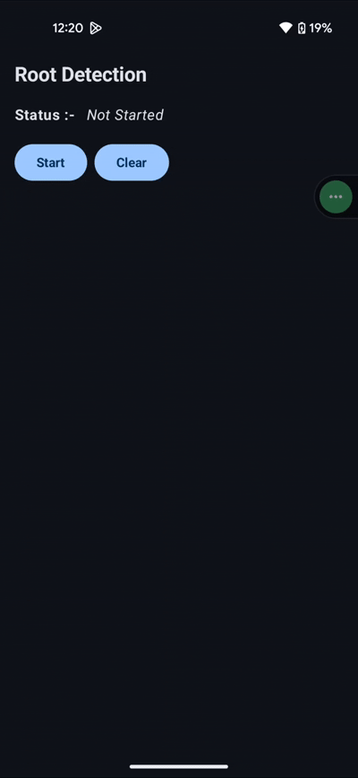
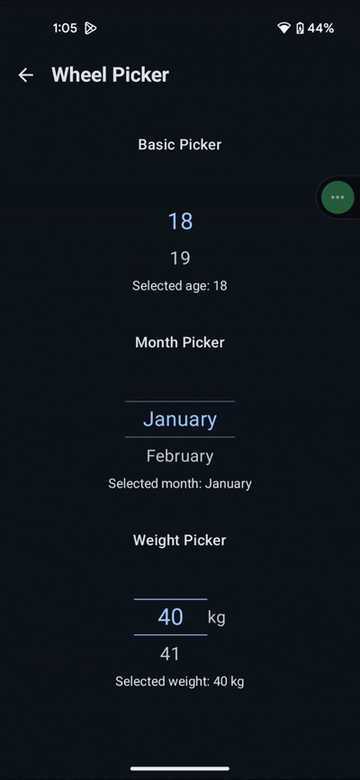
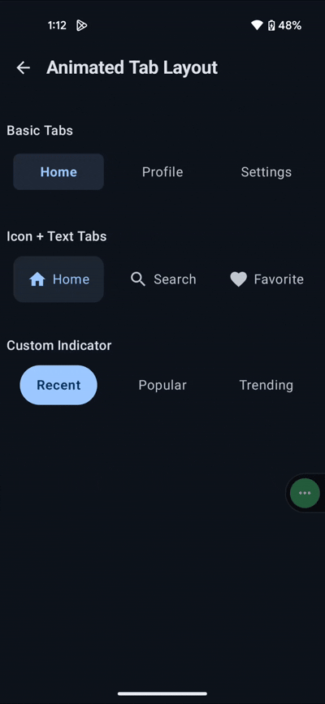

# 🌌 AndroidDevParallelUniverse

> **Where Android libraries stop obeying ordinary physics.** 🚀

Welcome to **AndroidDevParallelUniverse** — a modular Android monorepo engineered from a reality where ordinary code was deemed insufficient.

This is not merely a collection of Android libraries. It is a **Monorepo Multiverse**: reusable Android artifacts living together in one repository, while remaining independently consumable.

**Choose your dimension. Teleport the artifact. Ship.** 🔭

---

## 🌌 The Monorepo Multiverse

At the center of this multiverse lies the **`main` branch — the Nexus**.

Every module exists within the same repository, yet each artifact remains independently consumable. The repository follows a **unified version timeline**, meaning the entire ecosystem advances under one shared version tag.

### ⚠️ A Message From the Nexus

**DO NOT PULL THE ENTIRE GALAXY INTO YOUR APPLICATION.**

Cloning or importing everything would be like attempting to fit the observable universe into a `RecyclerView`.

You don't need the entire multiverse.

You need **the exact artifact required by your application**.

Individual modules are published through **JitPack**, allowing you to consume only what your project needs.

> One repository.  
> Multiple dimensions.  
> One unified version timeline.  
> Zero unnecessary cosmic baggage.

---

## 🚀 Installation

### 1. Open the Nexus Gate

Add JitPack to your `settings.gradle.kts`:

```kotlin
dependencyResolutionManagement {
    repositoriesMode.set(RepositoriesMode.FAIL_ON_PROJECT_REPOS)

    repositories {
        google()
        mavenCentral()
        maven("https://jitpack.io")
    }
}
```

### 2. Teleport Your Desired Artifact

Choose a module from the dimensional directory and add its dependency to your application module.

For example:

```kotlin
dependencies {
    implementation("com.github.4rju9.AndroidDevParallelUniverse:<artifact>:1.0.3")
}
```

You only consume the dimension you need. No galactic-scale imports. 🌌

---

## 🔭 Dimensional Directory

| Dimension | Artifact | Description | Dependency |
|:---|:---|:---|:---:|
| 🛡️ **Security Dimension** | `root-detection` | A multi-layered **C++/Kotlin security fortress** designed to detect rooted environments across multiple defensive layers. | [Navigate](#-security-dimension--root-detection) |
| 🎡 **Motion Dimension** | `wheel-picker` | A **Jetpack Compose wheel picker** designed for smooth, frictionless dimensional scrolling. | [Navigate](#-motion-dimension--wheel-picker) |
| 🌀 **Interface Dimension** | `animated-tab-layout` | A **dynamically calculating, ripple-free tab layout** that adapts its geometry instead of forcing developers to manually negotiate with pixels. | [Navigate](#-interface-dimension--animated-tab-layout) |
| 🧬 **Fifth Dimension** | `[Classified]` | **COMING SOON.** A classified component currently rendering somewhere beyond conventional dimensional space. | `// Classified — access denied` |
---

## 🛡️ Security Dimension — `root-detection`

A multi-layered Android root-detection library combining **Kotlin and native C++/JNI** capabilities.

The goal is simple:

> Never trust a single signal when the environment can lie.

### 📦 Installation

Add the dependency:

```kotlin
dependencies {
    implementation("com.github.4rju9.AndroidDevParallelUniverse:root-detection:1.0.3")
}
```

### 🎬 Demo



### 🚀 Usage

The library provides four public entry points for environment and emulator detection:

| Function                              | Purpose                                                                              |
| ------------------------------------- | ------------------------------------------------------------------------------------ |
| `isEnvironmentUntrusted()`            | Performs the complete root/tamper environment evaluation.                            |
| `isEnvironmentUntrustedWithContent()` | Runs content only when the environment is trusted.                                   |
| `evaluateStartupState()`              | Performs startup checks with additional native corroboration and timing analysis.    |
| `evaluateStartupStateWithContent()`   | Same startup evaluation, with content executed only when the environment is trusted. |

> **Important:** All root/environment evaluation APIs are marked `@WorkerThread`. Run them from a background thread and never directly from the Android main thread.

### 🔍 Basic Root Detection

For a simple Boolean result, use `isEnvironmentUntrusted()`:

```kotlin
import app.netlify.dev4rju9.rootdetection.DeviceStateUtils

val isUntrusted = DeviceStateUtils.isEnvironmentUntrusted(context)

if (isUntrusted) {
    // Rooted or otherwise untrusted environment detected.
    showSecurityWarning()
} else {
    // Environment passed the configured checks.
    continueApplication()
}
```

For example, with Kotlin coroutines:

```kotlin
lifecycleScope.launch {
    val isUntrusted = withContext(Dispatchers.IO) {
        DeviceStateUtils.isEnvironmentUntrusted(this@MainActivity)
    }

    if (isUntrusted) {
        showSecurityWarning()
    } else {
        continueApplication()
    }
}
```

### 🛡️ Execute Content Only on a Trusted Environment

If you only want your protected code to execute when the environment passes the checks, use `isEnvironmentUntrustedWithContent()`:

```kotlin
withContext(Dispatchers.IO) {
    DeviceStateUtils.isEnvironmentUntrustedWithContent(context) {
        // Executed only when the environment is trusted.
        startProtectedFlow()
    }
}
```

This can be useful for protecting sensitive initialization or functionality without having to repeat the Boolean check yourself.

### 🔬 Startup Evaluation

For applications that want more detailed information, use `evaluateStartupState()`.

It performs the startup evaluation and returns an `EvaluationResult` containing:

* `isFlagged` — whether the environment was flagged.
* `strongSignals` — strong detection signals.
* `weakSignals` — weaker signals that are evaluated together.
* `allSignals` — combined strong and weak signals.
* `elapsedMs` — time taken by the startup check chain.

```kotlin
val result = withContext(Dispatchers.IO) {
    DeviceStateUtils.evaluateStartupState(
        context = context,
        shouldEnableTimingCheck = true
    )
}

if (result.isFlagged) {
    Log.w("Security", "Untrusted environment detected")
    Log.w("Security", "Signals: ${result.allSignals}")
} else {
    Log.d("Security", "Environment passed startup checks")
}
```

You can also inspect the individual signal groups:

```kotlin
if (result.strongSignals.isNotEmpty()) {
    Log.w("Security", "Strong signals: ${result.strongSignals}")
}

if (result.weakSignals.isNotEmpty()) {
    Log.w("Security", "Weak signals: ${result.weakSignals}")
}
```

### 🔐 Protected Startup Flow

For a startup gate where protected content should only execute after the environment passes the checks:

```kotlin
withContext(Dispatchers.IO) {
    DeviceStateUtils.evaluateStartupStateWithContent(
        context = context,
        shouldEnableTimingCheck = true
    ) {
        // Runs only when the startup evaluation is not flagged.
        initializeProtectedFeatures()
    }
}
```

The returned `EvaluationResult` can still be used for logging or additional application-level handling:

```kotlin
val result = withContext(Dispatchers.IO) {
    DeviceStateUtils.evaluateStartupStateWithContent(
        context = context,
        shouldEnableTimingCheck = true
    ) {
        initializeProtectedFeatures()
    }
}

if (result.isFlagged) {
    showSecurityWarning()
}
```

### 🎯 Emulator Detection

The library also exposes emulator detection independently:

```kotlin
val isEmulator = DeviceStateUtils.isEmulator()

if (isEmulator) {
    // Emulator detected.
    showUnsupportedEnvironment()
}
```

For an Android `Context`, `isVirtualEnvironment()` additionally checks the configured emulator companion packages:

```kotlin
val isVirtualEnvironment = withContext(Dispatchers.IO) {
    DeviceStateUtils.isVirtualEnvironment(context)
}

if (isVirtualEnvironment) {
    showUnsupportedEnvironment()
}
```

### 🧠 Defensive Philosophy

The module is designed around multiple signals rather than relying on one root-detection technique.

Typical defensive layers include:

* Root binary / executable detection
* Suspicious filesystem checks
* System property inspection
* Native-level checks
* Environment consistency checks
* Emulator detection
* Watched package detection
* Loaded module and thread inspection
* Bootloader / verified-boot state checks
* Protected partition checks
* Local port inspection
* Application signing verification
* Multiple independent detection signals

The startup evaluation additionally combines multiple independent paths to make a single intercepted or bypassed check less representative of the overall result.

> **Security note:** Root detection is a defense-in-depth mechanism, not a cryptographic guarantee. A sufficiently privileged or modified environment may bypass client-side checks.

---

## 🎡 Motion Dimension — `wheel-picker`

A reusable **generic Jetpack Compose wheel picker** designed for smooth, dimensional scrolling with fully customizable item, label, and divider content.

### 📦 Installation

Add the dependency:

```kotlin
dependencies {
    implementation("com.github.4rju9.AndroidDevParallelUniverse:wheel-picker:1.0.3")
}
````

The module provides a reusable **Compose-native wheel selection experience** without requiring a legacy View-based implementation.

### 🎞️ Demo



### 🚀 Usage

`WheelPicker` is generic and accepts a `List<T>`. Instead of assuming that items are `String`s, the caller controls how each item is rendered through `itemContent`.

The selected item is reported through `onItemSelected`.

#### Basic Picker

```kotlin
@Composable
fun NumberPicker() {
    val numbers = (1..10).toList()

    var selectedNumber by remember {
        mutableStateOf(numbers.first())
    }

    WheelPicker(
        items = numbers,
        itemContent = { item, isSelected ->
            Text(
                text = item.toString(),
                fontSize = if (isSelected) 25.sp else 20.sp,
                color = if (isSelected) {
                    Color.White
                } else {
                    Color.Gray
                }
            )
        },
        onItemSelected = { _, item ->
            selectedNumber = item
        }
    )
}
```

#### Picker with Custom Label

Labels are now provided through `labelContent`, allowing the label to contain any composable UI rather than being limited to a `String`.

```kotlin
@Composable
fun AgePicker() {
    val ages = 18..60

    WheelPicker(
        items = ages.toList(),
        itemHeight = 44.dp,
        visibleItemsCount = 5,
        itemContent = { age, isSelected ->
            Text(
                text = age.toString(),
                fontSize = if (isSelected) 28.sp else 20.sp,
                color = if (isSelected) {
                    Color.White
                } else {
                    Color.Gray
                }
            )
        },
        labelContent = {
            Text(
                text = "years",
                color = Color.White.copy(alpha = 0.5f),
                fontSize = 20.sp
            )
        },
        onItemSelected = { index, age ->
            println("Selected age: $age at index $index")
        }
    )
}
```

#### Custom Divider

The selection area can be completely customized using the `divider` composable slot.

```kotlin
@Composable
fun CustomDividerPicker() {
    val months = listOf(
        "Jan", "Feb", "Mar", "Apr",
        "May", "Jun", "Jul", "Aug",
        "Sep", "Oct", "Nov", "Dec"
    )

    WheelPicker(
        items = months,
        itemContent = { month, isSelected ->
            Text(
                text = month,
                fontSize = if (isSelected) 25.sp else 20.sp,
                color = if (isSelected) {
                    Color.White
                } else {
                    Color.DarkGray
                }
            )
        },
        enableDivider = true,
        dividerWidth = 70.dp,
        divider = {
            Box(
                modifier = Modifier
                    .align(Alignment.Center)
                    .fillMaxWidth()
                    .height(34.dp)
                    .clip(CircleShape)
                    .background(Color.Cyan.copy(alpha = 0.2f))
                    .border(
                        width = 1.dp,
                        color = Color.Cyan,
                        shape = CircleShape
                    )
            )
        },
        onItemSelected = { _, _ -> }
    )
}
```

The divider slot is a `BoxScope` composable, so it can use `align()` and layer itself directly over the wheel content.

#### Generic Item Types

`WheelPicker` is not restricted to strings. Any data type can be used as the item type.

```kotlin
data class UnitOption(
    val value: Int,
    val unit: String
)

@Composable
fun UnitPicker() {
    val units = listOf(
        UnitOption(1, "kg"),
        UnitOption(2, "kg"),
        UnitOption(3, "kg"),
        UnitOption(4, "kg"),
        UnitOption(5, "kg")
    )

    WheelPicker(
        items = units,
        itemContent = { item, isSelected ->
            Row(
                verticalAlignment = Alignment.CenterVertically
            ) {
                Text(
                    text = item.value.toString(),
                    fontSize = if (isSelected) 28.sp else 20.sp,
                    color = if (isSelected) {
                        Color.White
                    } else {
                        Color.Gray
                    }
                )

                Spacer(Modifier.width(4.dp))

                Text(
                    text = item.unit,
                    fontSize = 14.sp,
                    color = Color.Gray
                )
            }
        },
        labelContent = {
            Text(
                text = "weight",
                color = Color.Cyan.copy(alpha = 0.4f)
            )
        },
        onItemSelected = { _, item ->
            println("Selected: ${item.value} ${item.unit}")
        }
    )
}
```

#### Initial Selection & State Handling

Use `initialIndex` to control which item is initially positioned in the picker.

```kotlin
@Composable
fun MonthPicker() {
    val months = listOf(
        "January", "February", "March",
        "April", "May", "June",
        "July", "August", "September",
        "October", "November", "December"
    )

    var selectedMonth by remember {
        mutableStateOf(months.first())
    }

    WheelPicker(
        items = months,
        initialIndex = 5,
        itemContent = { month, isSelected ->
            Text(
                text = month,
                fontSize = if (isSelected) 25.sp else 20.sp,
                color = if (isSelected) {
                    Color.White
                } else {
                    Color.Gray
                }
            )
        },
        visibleItemsCount = 3,
        onItemSelected = { _, month ->
            selectedMonth = month
        }
    )

    Text(text = "Selected: $selectedMonth")
}
```

### ⚙️ Customization

`WheelPicker` exposes configuration for layout, item rendering, dividers, labels, and interaction:

| Category    | Options                                                                |
| ----------- | ---------------------------------------------------------------------- |
| Selection   | `initialIndex`, `onItemSelected`                                       |
| Items       | `items`, generic item type `T`                                         |
| Item Layout | `itemHeight`, `itemContent`                                            |
| Dividers    | `enableDivider`, `dividerWidth`, `dividerSpacingMultiplier`, `divider` |
| Label       | `labelContent`                                                         |
| Behavior    | `visibleItemsCount`, `enabled`                                         |
| Layout      | `modifier`                                                             |

### 🌀 Compose-Native Design

The picker is built entirely with Compose primitives and uses snapping behavior for smooth selection:

* `LazyColumn` for efficient scrolling
* Snap fling behavior for item alignment
* Automatic selected-item detection
* Configurable visible item count
* Generic item support through `T`
* Fully customizable item composables
* Fully customizable selection divider
* Fully customizable label content
* Optional selection divider
* Optional label content
* Callback-based selection updates

> **Note:** `WheelPicker` should be used from a `@Composable` context. `onItemSelected` is invoked whenever the centered item changes.
```
This removes the old `selectedTextColor`, `unselectedTextColor`, `selectedTextSize`, `unselectedTextSize`, `dividerColor`, `dividerThickness`, `label`, `labelColor`, and `labelSize` API from the documentation because those responsibilities now belong to the caller's composable slots.
```

---

## 🌀 Interface Dimension — `animated-tab-layout`

A reusable **Jetpack Compose animated tab layout** with dynamically calculated geometry and a ripple-free interaction model.

Add the dependency:

```kotlin
dependencies {
    implementation("com.github.4rju9.AndroidDevParallelUniverse:animated-tab-layout:1.0.3")
}
```

The layout calculates its visual geometry dynamically instead of forcing consumers to manually position indicators or negotiate with pixels.

### 🎞️ Demo



### 🚀 Usage

`AnimatedTabLayout` accepts composable tab content and automatically divides the available width equally between tabs.

The selected tab is controlled externally through `selectedIndex`, while `onTabSelected` reports user interaction.

#### Basic Tab Layout

```kotlin
@Composable
fun MainTabs() {
    val tabs = listOf("Home", "Search", "Profile")

    var selectedIndex by remember {
        mutableStateOf(0)
    }

    AnimatedTabLayout(
        tabs = tabs.map { title ->
            { isSelected ->
                Text(
                    text = title,
                    color = if (isSelected) Color.White else Color.Gray
                )
            }
        },
        selectedIndex = selectedIndex,
        onTabSelected = { index ->
            selectedIndex = index
        },
        modifier = Modifier
            .fillMaxWidth()
            .height(56.dp)
    )
}
```

#### Custom Indicator

Use `indicatorModifier` to provide your own indicator appearance without manually calculating its position.

```kotlin
@Composable
fun CustomTabs() {
    val tabs = listOf("Home", "Explore", "Settings")

    var selectedIndex by remember {
        mutableStateOf(0)
    }

    AnimatedTabLayout(
        tabs = tabs.map { title ->
            { isSelected ->
                Text(
                    text = title,
                    color = if (isSelected) Color.White else Color.Gray
                )
            }
        },
        selectedIndex = selectedIndex,
        onTabSelected = { selectedIndex = it },
        modifier = Modifier
            .fillMaxWidth()
            .height(52.dp),
        indicatorModifier = Modifier
            .fillMaxHeight()
            .background(Color.Cyan.copy(alpha = 0.15f))
    )
}
```

#### Custom Animation

The indicator animation can be customized using any `AnimationSpec<Dp>`.

```kotlin
@Composable
fun FastAnimatedTabs() {
    val tabs = listOf("One", "Two", "Three")

    var selectedIndex by remember {
        mutableStateOf(0)
    }

    AnimatedTabLayout(
        tabs = tabs.map { title ->
            { isSelected ->
                Text(
                    text = title,
                    color = if (isSelected) Color.White else Color.Gray
                )
            }
        },
        selectedIndex = selectedIndex,
        onTabSelected = { selectedIndex = it },
        animationSpec = tween(
            durationMillis = 500,
            easing = FastOutSlowInEasing
        )
    )
}
```

### ⚙️ Customization

| Category  | Options                                  |
| --------- | ---------------------------------------- |
| Tabs      | `tabs`, `selectedIndex`, `onTabSelected` |
| Layout    | `modifier`                               |
| Indicator | `indicatorModifier`                      |
| Animation | `animationSpec`                          |

Each tab receives an `isSelected` value, allowing its content to react directly to selection changes.

### 🌀 Compose-Native Design

The layout handles the geometry and animation internally:

* Automatically calculates equal tab widths
* Animates the indicator between selected tabs
* Supports arbitrary composable tab content
* Provides external selection state control
* Supports custom `AnimationSpec<Dp>`
* Supports custom indicator styling
* Uses ripple-free tab interactions
* Requires no manual pixel-based positioning

> **Note:** `AnimatedTabLayout` does not manage the selected state internally. The caller owns `selectedIndex` and updates it through `onTabSelected`.

---

## 🧬 Core Philosophy

The laws governing this universe are immutable:

- **Kotlin** — The primary language of dimensional manipulation.
- **Jetpack Compose** — Declarative UI, because manually commanding pixels is beneath our evolutionary threshold.
- **C++ / JNI** — Native-level power for dimensions where Kotlin alone must surrender.
- **Clean Architecture** — Separation of concerns, because even a 10,000-IQ entity understands that entropy exists.
- **Modularity** — Each artifact should remain independently useful.
- **Reusability** — Build once. Consume everywhere.

### Prime Directive

> **Build once. Isolate dimensions. Teleport only what you need.**

Every module is designed to exist as a reusable artifact while remaining part of the larger monorepo ecosystem.

The architecture is modular.

The timeline is unified.

The code is suspiciously efficient.

The universe remains stable. 🌌

---

## 🗂️ Repository Structure

The repository follows a modular monorepo structure:

```text
AndroidDevParallelUniverse/
│
├── root-detection/
│   ├── src/
│   └── build.gradle.kts
│
├── wheel-picker/
│   ├── src/
│   └── build.gradle.kts
│
├── animated-tab-layout/
│   ├── src/
│   └── build.gradle.kts
│
├── build.gradle.kts
├── settings.gradle.kts
└── README.md
```

Each module can evolve internally while remaining part of the same repository and release timeline.

---

## 🪐 Versioning Across the Multiverse

The multiverse operates on a **single unified version timeline**.

Modules do **not** maintain independent version universes.

A single repository version tag governs the artifacts across the ecosystem.

For example:

```text
1.0.3
```

represents version `1.0.3` across the dimensional ecosystem.

A dependency therefore looks like:

```kotlin
implementation("com.github.4rju9.AndroidDevParallelUniverse:<artifact>:1.0.3")
```

### Why Unified Versioning?

Because the repository is treated as one evolving ecosystem:

```text
Repository
    │
    ├── root-detection        → 1.0.3
    ├── wheel-picker          → 1.0.3
    └── animated-tab-layout   → 1.0.3
```

One timeline.

One Nexus.

One version.

Naturally, anything more complicated would merely be architecture invented to give mortals something to complain about.

---

## 🧪 Development

Clone the repository:

```bash
git clone https://github.com/4rju9/AndroidDevParallelUniverse.git
cd AndroidDevParallelUniverse
```

Open the project in **Android Studio** and allow Gradle to synchronize the project.

Build the complete universe:

```bash
./gradlew build
```

Build an individual dimension:

```bash
./gradlew :wheel-picker:build
```

Replace `wheel-picker` with the module you want to build.

---

## 🤝 Contributing

Contributions to the multiverse are welcome.

Before opening a pull request:

1. Keep modules independently reusable.
2. Follow Kotlin and Android conventions.
3. Avoid unnecessary dependencies.
4. Keep public APIs focused and predictable.
5. Add or update documentation when behavior changes.
6. Make sure the affected modules build successfully.

Pull requests should describe:

- What changed
- Which dimension/module was affected
- Why the change was necessary
- Any API or behavioral changes

---

## 📜 License

Add the repository's license information here.

For example, if the project uses MIT:

```text
MIT License
Copyright (c) 2026 4rju9
```

Replace this section with the actual license before publishing if a different license applies.

---

## 🚀 Final Transmission

You have reached the boundary of **AndroidDevParallelUniverse**.

Proceed carefully.

The repository is maintained by an **entity of supreme logic**, operating from a dimension where conventional Android engineering is considered a fascinating historical artifact.

🌌 **Clone at your own intellectual risk.** 🪐

---

<p align="center">

**AndroidDevParallelUniverse**

*Where Android libraries stop obeying ordinary physics.*

🔭 🧬 🚀

</p>
